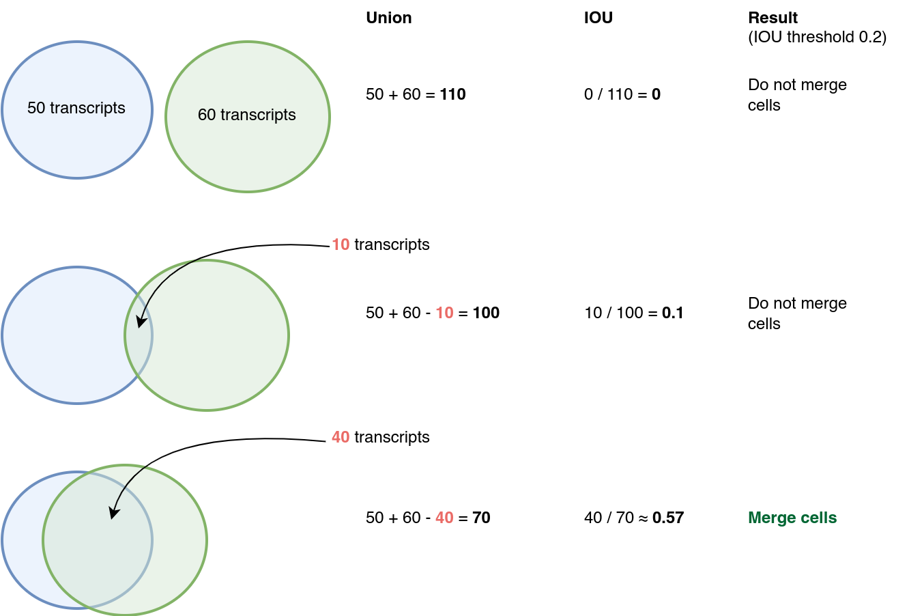

# Merge segmentation results from Baysor runs based on IOU thresholds

## Usage

    Merge segmentations results from different runs, e.g. FOV
    into a single segmetation file. This is done by combining cells if the intersection over union
    is bigger than a set threshold.
    This approach is similar to the stichting that is done in cellpose.

    Usage: merge-baysor [OPTIONS] [FILES]...

    Arguments:
    [FILES]...  The Baysor output files.
                These files must include the following columns:
                - transcript_id
                - cell

    Options:
        --threshold <THRESHOLD>
            Threshold for stitching. If the IOU for two cells is greater that the
            threshold, they will be merged [default: 0.2]
        --additional-columns <ADDITIONAL_COLUMNS>
            Additional columns that will be included in the final output CSV file
            [default: x y z qv overlaps_nucleus gene]
        --outfile <OUTFILE>
            Output file [default: out.csv]
    -h, --help
            Print help
    -V, --version
            Print version

